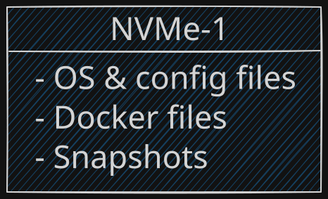
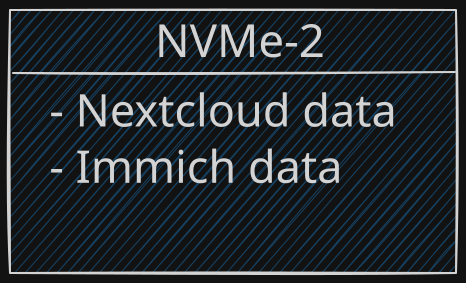
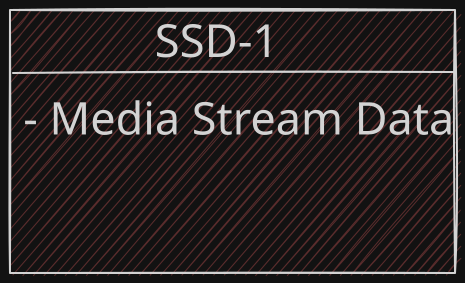
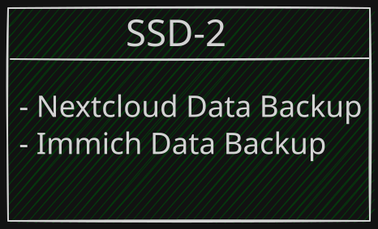
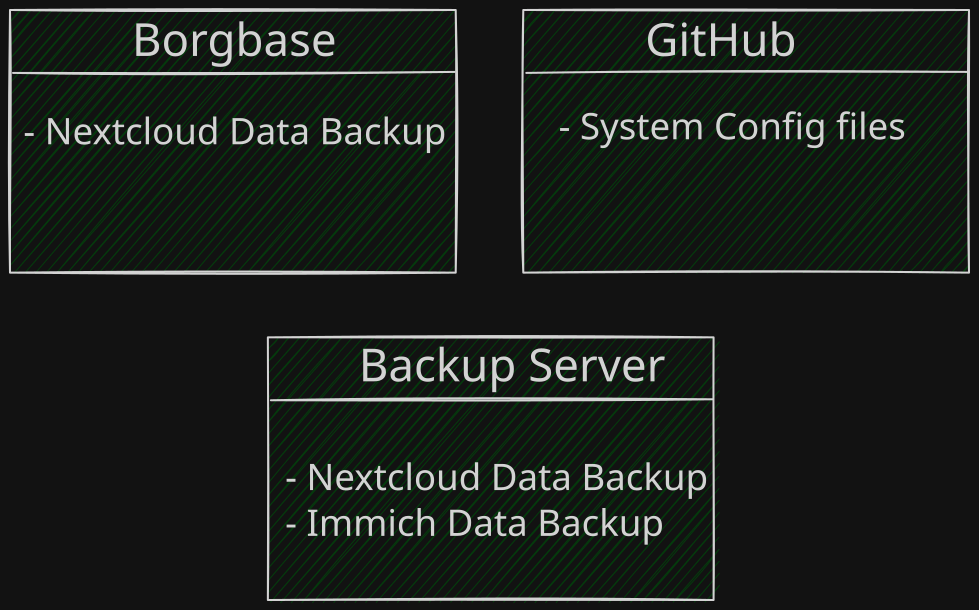
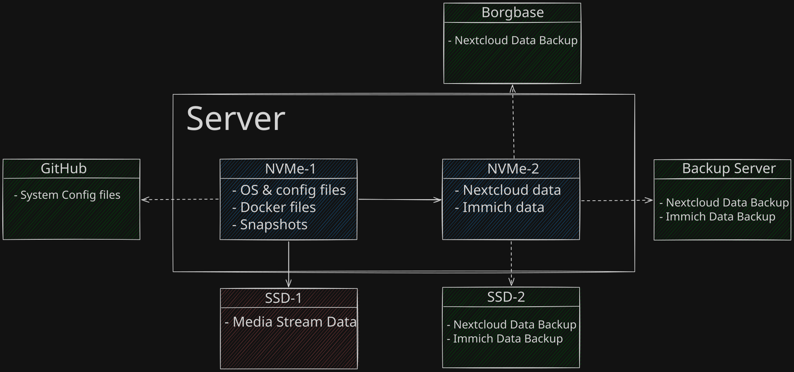

## Introdução

Nesse post falo sobre como planejo criar meu próprio ecossistema digital, incluindo gerenciamento de arquivos em nuvem, aplicativo de mensagens, ligações, calendário, streaming, e etc.

No momento em que escrevo esse post tudo está em fase de estudo e teste. Quero mostrar o que aprendi durante esse processo e documentar aprendizados úteis.

## Camadas de Abstração

A primeira camada de abstração é chamada de domain:

- **System Config Domain (SCD)**: Onde fica tudo relacionado a arquivos de configuração.
- **System Data Domain (SDD)**: Onde fica os dados importantes dos usuários
- **Backup Data Domain (BDD)**: Armazena backups do SDD.
- **Offsite Backup Domain (OBD)**: Armazena backup em nuvem ou servidor próprio.

Segunda camada, stacks:

- **Nextcloud App Stack**
- **Streaming Stack**
- **Immich Stack**

## Domain

Domain são discos diferentes com funções específicas dentro do servidor.

## Stack

Cada stack é um arquivo docker compose. Tudo vai rodar no mesmo host, mas com separações clara de dados
baseada em dois NVMe e dois SSDs.
Os discos de armazenamento tem partições separadas, cada partição armazena dados de uma stack especifica.

## Acesso ao servidor

A comunicação externa com o sistema é feita via ssh por intermédio do Tailscale. Stacks como streaming e immich tem um container docker construído com a imagem base do Tailscale. Dessa forma posso dar um domínio próprio na tailnet para cada stack.

### SCD — System Config Domain

**NVMe-1**: Focado na parte de configuração e gerenciamento de todo o sistema - onde o SO vai está instalado e sera acessado remotamente.



Parte importante para o bom funcionamento do sistema, mas nada critico em termos de dados importantes. Por tanto, apenas snapshots são suficientes.

### SDD — System Data Domain

**NVMe-2**: Aqui fica todos os dados importantes como: imagens, videos, audios, dentre outros arquivos do Nextcloud e Immich.



O `NVMe-2` está particionado da seguinte forma:

```
nvme0n1     259:0    0 476.9G  0 disk
├─nvme0n1p1 259:1    0   200G  0 part  /mnt/immich
└─nvme0n1p2 259:2    0 276.9G  0 part  /mnt/nextcloud
```

Ambas as partições estão no formato `ext4`.

**SSD-1**: Responsável por armazenar toda a mídia de streaming. Pensando a longo prazo, como filmes e series tendem a consumir muito armazenamento, multiplicando isso por usuário, acredito ser razoável ter um disco dedicado.
Como esses arquivos são rebaixáveis, backup aqui é desnecessário. Arquivo do próprio Nextcloud podem fica junto visualmente com a parte de streaming, mas em um disco separado.



### BDD — Backup Data Domain

**SSD-2**: Backup de todos os dados do [SDD](#sdd--system-data-domain). Sem muito segredo, backups periódicos com borg aqui é suficiente.



### OBD — Offsite Backup Domain

**Offsite**: Backup em nuvem apenas como mais uma medida de prevenção. Como não quero gastar muito e nem delegar dados para terceiros, o backup offsite em plataformas externas é mínimo.
Ainda existe um servidor externo próprio para redundância do [BDD](#bdd--backup-data-domain), garantindo ainda mais a confiabilidade. Diferente do backup offsite com Borgbase, esse tem backup completo de longa retenção.



## Arquitetura Final


