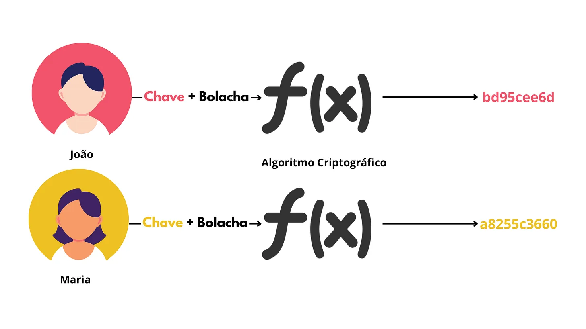
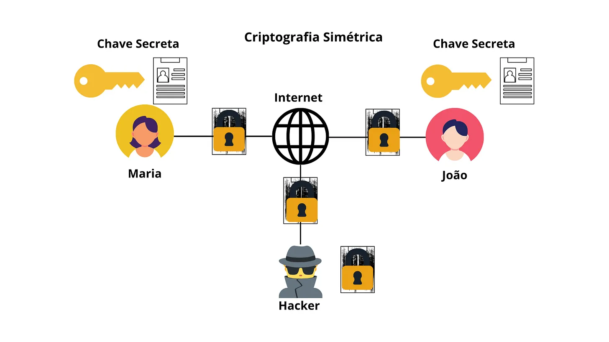
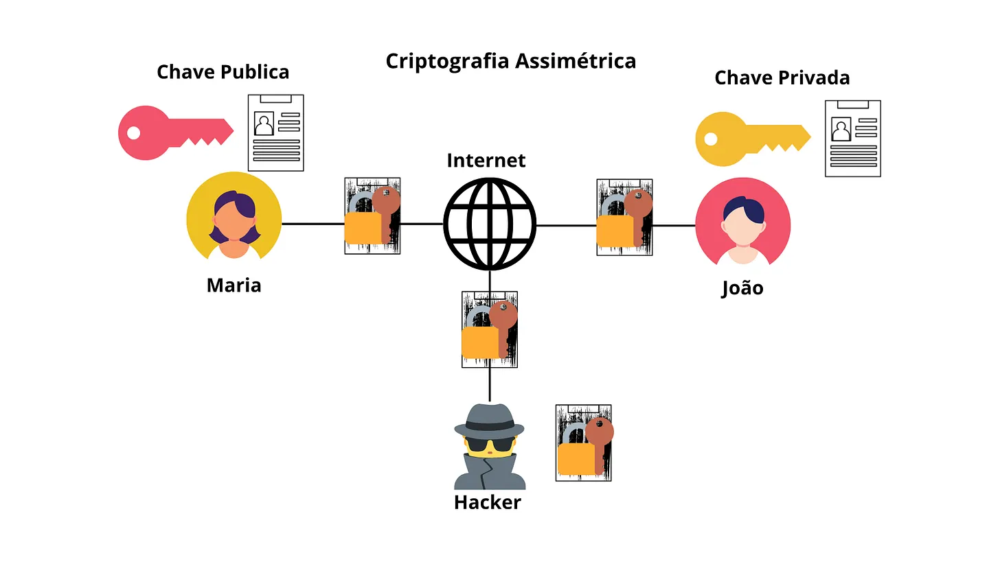

## Introdução

Escrevi esse post com o intuito de mostrar, mesmo que de forma simples, um pouco da importância da criptografia na segurança, privacidade e comunicação digital.

Criptografia é um dos assuntos mais complexos de se explicar de forma simples sem cometer um assassinato técnico. Onde eu simplifiquei demais, simplifiquei de propósito — e assumo o risco.

## Criptografia

Há tipos diferentes de criptografia. A diferença principal entre cada uma é o conceito de **chaves**. Em criptografia, chaves são usadas para embaralhar uma informação, transformando os dados legíveis (texto não criptografado) em um formato ilegível (texto criptografado). Dessa forma, somente quem tem a chave pode descriptografar a informação para seu conteúdo original.

## Chaves

Elas servem como um segredo que protege a informação, de forma que somente quem tem determinada chave pode ter acesso ao conteúdo criptografado. Além disso, permite qualquer pessoa no mundo usar o mesmo algoritmo e que cada uma tenha resultados diferentes, mesmo criptografando a mesma informação.

Sem o uso de chaves únicas e aleatoriamente geradas, o algoritmo geraria o mesmo texto criptografado para dados iguais. Com o uso de uma chave é inserido um fator aleatório e secreto, o que torna o texto criptografado único. Assim, somente o possuidor da chave pode descriptografar o texto. Por isso a importância de uma chave segura.

**Exemplo com o uso de chave:**

- João e Maria estão querendo criptografar a mesma informação

- Assim como também estão usando o mesmo algoritmo para encriptar o dado

- Entretanto, como cada um está usando uma chave secreta totalmente diferente, o texto criptografado será totalmente diferente para cada um

- Como resultado, o texto criptografado é diferente mesmo criptografando a mesma informação

Por um rigor técnico, implementações reais, usam também um vetor de inicialização (IV) para garantir que mensagens iguais não gerem o mesmo texto cifrado. Dessa forma, mesmo rodando o algoritmo várias vezes com o mesmo dado e mesma chave, faz com que o texto criptografado seja sempre diferente. Isso torna o algoritmo mais imprevisível, impedindo ataques de análise de padrões e aumentando a segurança.

## Manter a chave segura

Após a geração da chave existem algumas etapas cruciais para mantê-la segura.

### Geração

Esse processo é vital, pois está relacionado também a qualidade da criptografia. Para uma geração segura é preciso certificar-se de que o processo de geração seja realmente aleatório. Um computador é incapaz de gerar números verdadeiramente aleatórios, o que ele gera são números pseudoaleatórios. Uma máquina somente segue instruções preestabelecidas. Nesse caso é necessário o uso de uma entropia (é a medida da imprevisibilidade e aleatoriedade de uma fonte de dados), como movimentos do mouse, intervalos entre pressionamentos de teclas e pequenas variações de tempo em operações do sistema, que servem como fontes de entropia.

Outro fator importante para a segurança na geração é o tamanho da chave, dificultando ainda mais a descoberta por um atacante. Dependendo do algoritmo, o tamanho considerado inseguro é de chaves menores que 128 bits para criptografia simétrica e 2048 bits para criptografia assimétrica.

### Distribuição

A geração de uma chave bem feita não valerá de nada se você fizer uma distribuição com muitas brechas para atacantes. Use meios seguros criptografados, como protocolos de distribuição de chaves e canais criptografados.

### Armazenamento

Não importa o quão segura sua chave seja se o ambiente não for. Garanta que a chave permaneça inacessível a pessoas não autorizadas e evite o roubo da chave, armazenando-a em locais seguros. Existem ferramentas dedicadas para o armazenamento de chaves criptográficas como HSM (hardware security module).

### Rotação

Consiste em não manter a mesma chave por muito tempo, é recomendada a troca de no mínimo uma vez por ano. Ajuda na redução do impacto de uma chave perdida, dando menos tempo de exposição dos dados.

### Controle de acesso

Independente do processo utilizado no controle da chave, é preciso ter o controle de quem pode e não pode ter acesso. Isso pode ser realizado por meio de senhas e privilégios de cada usuário no sistema ou ambiente físico.

## Criptografia Simétrica

Usa a **mesma chave secreta** para criptografar e descriptografar informações.

A imagem representa duas pessoas trocando informação através da internet usando criptografia simétrica.

Mais adiante vou discutir sobre o compartilhamento de chaves, mas por agora vamos dizer que somente Maria e João têm essa chave. Com isso dito, o fluxo é o seguinte:

- Maria quer enviar certo arquivo a João, então usa sua chave secreta para transformar o arquivo em um código ilegível (texto cifrado).

- Esse arquivo criptografado é enviado através da internet (e-mail, aplicativo de mensagens, etc.).

- Antes da mensagem chegar até João, hackers podem interceptar a mensagem, mas não vão conseguir ler seu conteúdo sem a chave secreta.

- Quando a mensagem chega até João, ele usa a mesma chave que Maria usou para criptografar para ter acesso ao conteúdo original do arquivo. Ou seja, João realiza a descriptografia.

Esse cenário retrata a troca de informação ideal, entretanto nesse modelo ainda existem muitos pontos vulneráveis. A criptografia simétrica é só mais um ponto muito importante de vários outros mecanismos usados em conjunto para assegurar a troca de informações segura na internet.

No cenário atual apenas a **confidencialidade** é preservada, o que significa que o hacker no meio não consegue descobrir o conteúdo da mensagem.

Ainda existem mais 3 aspectos da segurança da informação importantes resolvidos pela criptografia, este foi apenas um deles.

## Criptografia Assimétrica

Usa um par de chaves matematicamente relacionadas: uma chave pública (compartilhada) e uma chave privada (secreta). A mensagem é criptografada com uma chave e só pode ser descriptografada pela outra chave do mesmo par.

Análogo à última imagem, temos Maria e João trocando informações através da internet. Mas, dessa vez eles optaram por usar a criptografia assimétrica. O esquema é o seguinte:

- Maria criptografa o arquivo com a chave pública de João (par da chave privada dele)

- Então Maria envia o arquivo para João através da internet

- A chave pública é de conhecimento público, qualquer um pode ter acesso

- O hacker poderia interceptar a mensagem, mas somente com a chave pública não é possível descriptografar

- Quando a mensagem chega até João, como dono da chave privada, ele pode descriptografar e ter acesso ao conteúdo original

Um dos pontos que fazem a criptografia assimétrica ser mais amplamente usada na troca de informações é devido à troca de chaves ser mais fácil. Diferente da simétrica, onde ambos devem ter a mesma chave que descriptografa, com isso, o compartilhamento da chave pode ficar mais arriscado.

Entretanto, existem alguns pros e contras de usar cada uma em relação ao outro. Por exemplo, a assimétrica tem um custo computacional maior, sendo assim mais custosa para muitos dados. Enquanto a simétrica é mais rápida para grandes volumes de dados, ela é mais vulnerável durante o processo de troca de chaves.

Entretanto, no mundo real o que acontece é o uso dos dois meios de criptografia. Aplicativos de mensagens, por exemplo, usam a criptografia assimétrica para estabelecer um canal seguro para troca de chaves, enquanto a troca de mensagem, sendo um processo mais ativo, é usada a criptografia simétrica.

## Compartilhamento de chaves

Como podemos ver, a criptografia resolve grande parte dos problemas de segurança digital. Entretanto, ainda existe o problema no compartilhamento de chaves. Problema resolvido pelos algoritmos RSA e Diffie-Hellman, dois assuntos importantes em criptografia. Assuntos esses que merecem um post dedicado, caso contrário esse post ficaria muito extenso.

## Conclusão

Espero ter cumprido com meu objetivo de dar uma introdução sólida sobre criptografia. Também espero ter despertado curiosidade em você leitor a pesquisar mais sobre criptografia e entender como a segurança da informação digital é feita.

O que você aprendeu:

- Conceito de chaves

- Como proteger suas chaves

- Diferença entre criptografia simétrica e assimétrica

- Exemplos práticos em imagens

- Detalhes técnicos e ganchos para pesquisas

## Até logo!

Os algoritmos RSA e Diffie-Hellman, que ficaram de fora aqui, são o assunto do próximo post. Para não perder, assine o [RSS](/rss.xml).
