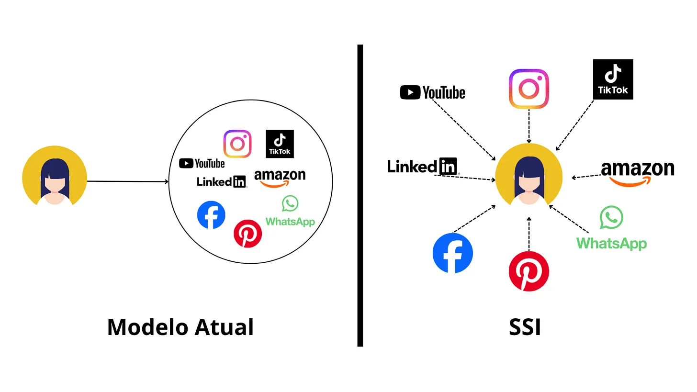

## Introdução

Devido a um trabalho da faculdade, onde o objetivo era criar uma ideia que resolvesse algum problema, pensei em criar um protocolo de compartilhamento de dados privados. Ideia essa que se propõe por o usuário em pleno controle de seus dados, tirando das grandes organizações o poder da identidade digital do indivíduo.

Esse texto é fruto da pesquisa que fiz para descobrir se essa ideia era viável. Desde o momento em que comecei a formalizar em minha mente como iria fazer isso, logo imaginei que alguém já devia ter pensando nisso. Sim, foi exatamente como imaginei, esse assunto está amplamente documento em artigos e até empresas já implementaram esse serviço.

O conceito de SSI está bem documentado em artigos pela internet, deixarei os links na sessão de fontes. O proposito desse texto é discutir a viabilidade dessa ideia e os problemas do sistema atual de governança de dados.

## Conceitos

Ao pesquisar me deparai com um conjunto de conceitos. Cada um deles é bastante extenso e técnico. Meu foco é passar as informações principais sobre como eles se correlacionam e como podem ser usados para dar vida a ideia.

## Fundamentos Conceituais e o ecossistema

- Identidade Auto-Soberana (Self-Sovereign Identity - SSI)
- O Triângulo da Confiança: Emissores, Detentores e Verificadores
- Identificadores Descentralizados (Decentralized Identifiers - DIDs)
- Credenciais Verificáveis (Verifiable Credentials - VCs)

## Arquitetura Tecnológica e Ferramentas

- Criptografia Assimétrica (Infraestrutura de Chave Pública - PKI)

- Blockchain e Smart Contracts

- Provas de Conhecimento Zero (Zero-Knowledge Proofs - ZKP)

- Carteiras Digitais de Identidade (Identity Wallets)

## O que é SSI

Definição da equipe [Dock Labs](https://www.dock.io/), líder no desenvolvimento de SSI:

> “A Identidade Auto-Soberana (SSI) é um modelo que dá aos indivíduos total propriedade e controle de suas identidades digitais, sem depender de terceiros. Em contraste com o gerenciamento centralizado de identidades, você é o dono da sua identidade e decide quem pode ver seus dados. Você também pode remover o acesso aos seus dados a qualquer momento.“

Explica em simples palavras o que já deveria ser o padrão atual. O artigo [Self-Sovereign Identity: The Ultimate Guide 2025](https://www.dock.io/post/self-sovereign-identity#origins-of-self-sovereign-identity) explica nos mínimos detalhes de forma simples os pilares, a origem e muito mais.

Esse modelo contradiz de forma radical o que conhecemos como privacidade de dados. Por exemplo, pare para pensar um pouco na lei LGPD (Lei Geral de Proteção de Dados Pessoais). Essa lei é construída em cima do pressuposto de que você deve compartilhar essas informações para terceiros, do qual vão ter pleno acesso a seus dados privados. O que “garante” o cumprimento dessa lei é a ameaça de sanções a empresa que a descumpra. De forma que mesmo na aplicação da lei ao infrator, a vítima já teve seus dados expostos, mesmo tendo algum tipo de indenização, o fato de seus dados estarem na internet é um dano irreversível.

Atualmente a cada site ou estabelecimento físico que passamos é nos pedido uma imensa quantidade de dados. Dessa forma, sua chance de ter dados vazado só aumenta.

Por exemplo, no site do [W3C](https://www.w3.org/TR/vc-data-model-2.0/) tem um parágrafo interessante. Onde ao invés de você informa sua data de nascimento, você precisaria apenas de uma credencial verificável que comprove que você é +18 sem expor sua data de nascimento.

Nosso país é uns do que mais deveriam buscar formas de mitigar o vazamento de dados. Entretanto, o Brasil figura entre líderes em vazamento de dados globais. Já perdi as contas de quantas vezes empresas me pediram documento via WhatsApp.

Dessa forma o individuo vira um refém de empresas, seus dados não são nada mais que números. Servindo como uma forma de controle e monitoramento. Originalmente a internet foi criada para identificar maquinas conectadas a rede, não indivíduos. Hoje o foco é em quem está usando a máquina, você nem pode instalar o Windows sem uma conta Microsoft. Isso se deu a necessidade de cada indivíduo ter dados governamentais únicos, criando um excesso de burocracia para uma empresa poder atuar no mercado. Como o atual vazamento de dados no Discord.

> Recentemente, em outubro de 2025, o Discord confirmou um vazamento de dados que afetou usuários que interagiram com suas equipes de Suporte ao Cliente ou de Confiança e Segurança. A falha de segurança não ocorreu nos sistemas internos do Discord, mas em um fornecedor terceirizado, a empresa de atendimento ao cliente 5CA.

O Discord por si não precisaria armazenar essa massiva quantidade de dados e ter que arcar com mais essa despesa se não fosse por questões burocráticas. Como se pode notar, o erro não foi no sistema em si, mas em um serviço de terceiros. Geralmente um ataque bem-sucedido é devido a um phishing e não exatamente a uma vulnerabilidade do sistema. Agora imagine seus dados espalhados em diferentes cantos da internet, isso aumenta a probabilidade de vazamento. De certa forma, o risco pode ser o não vazamento, já que você não sabe onde, como está sendo usado e com quem estão seus dados.

Você pode até dizer que as organizações são obrigadas a dizer para que estão pedindo seus dado e como vão usar. Mas o problema é que todo esse processo ocorre de forma privada, você não tem uma garantia concreta.

## Identificador descentralizado (Decentralized Identifier)

A W3C estabeleceu [identificadores descentralizados](https://www.w3.org/TR/did-1.0/) (DIDs), que descrevem os detalhes tecnológicos e os padrões que as organizações que criam soluções DID podem seguir. Novamente esse conceito é amplamente coberto em [Decentralized Identifiers (DIDs): The Ultimate Beginner’s Guide 2025](https://www.dock.io/post/decentralized-identifiers) feito pela equipe [Dock Labs](https://www.dock.io/).

Falando de forma mais direta e menos técnica, DIDs resolvem o problema de múltiplos logins e senhas. De forma grosseira, é até que uma solução bastante “previsível”, pois seu login serve para saber se você é realmente quem deveria ser. Os DIDs cumprem isso de forma fácil, assim como também é usado em várias tecnologias. Como, por exemplo, seu CPF (id unico).

Bom mais alguém pode afirmar: “Então vamos usar o CPF para nos identificar e fazer login”. O problema disso é que está atrelado a uma organização centralizada. Além disso, é propenso a roubo ou falsificação, por outro lado, DIDs resolvem isso com registros imutáveis em uma blockchain pública.

Não quero apenas repetir o que já foi bem explicado nas fontes linkadas. Mas é possível organizações certificadoras emitir credenciais únicas com suas chaves privadas, por meio de Credenciais Verificáveis (Verifiable Credentials - VCs).

Um resumo do próprio site da W3C. Veja completo [aqui](https://www.w3.org/TR/did-1.0/).

> Uma credencial verificável é uma forma específica de expressar um conjunto de reivindicações feitas por um emissor, como uma carteira de motorista ou um certificado educacional. Esta especificação descreve o modelo de dados extensível para credenciais verificáveis, como elas podem ser protegidas contra adulteração e um ecossistema de três partes para a troca dessas credenciais, composto por emissores, detentores e verificadores. Este documento também aborda uma variedade de considerações de segurança, privacidade, internacionalização e acessibilidade para ecossistemas que utilizam as tecnologias descritas nesta especificação.

## Provas de Conhecimento Zero

Toda verificação usa a tecnologia chamada Provas de Conhecimento Zero (Zero-Knowledge Proofs ou ZKP). Onde a comprovação de uma informação é feita sem revelar o conteúdo, segue um exemplo prático abaixo:

- Verificação Tradicional: Você envia uma foto da sua CNH para um site. O site (o “verificador”) vê seu nome, seu CPF, sua data de nascimento, sua foto, etc. Eles veem todos os dados para verificar apenas um (por exemplo, que você é maior de idade).

- Verificação com Conhecimento Zero: Você possui sua “credencial verificável” (como uma CNH digital) em uma carteira digital. O site (o “verificador”) pergunta à sua carteira: “Este cliente é maior de 18 anos?”. E então o sistema confirma.

Isso é o ápice da privacidade!!!

As carteiras SSI armazena e gerências suas credências verificáveis e dados pessoais. Gerencia quem pode e não pode acessar seus dados, podendo revogar acesso a qualquer momento. Usando as tecnologias aqui faladas, como DIDs, VSc e ZKP.

Essas carteiras usam um protocolo chamado [DIDComm](https://identity.foundation/didcomm-messaging/spec/v2.1/) (Comunicação de Identificador Descentralizado). Esse protocolo criptografa os dados usando criptografia assimétrica, de forma que somente a pessoa que tem determinada chave possa descriptografar. Para adicionar mais segurança, a informação é criptografada usando a chave publica do dentinário e a privada do remetente. De forma que o destinatário tem certeza da origem da mensagem. Existem dois tipos de criptografia:

- Authcrypt (Autenticada): Revela e autentica o remetente apenas para os destinatários autorizados.

- Anoncrypt (Anônima): Garante a confidencialidade e a integridade da mensagem, mas não revela a identidade do remetente.

## Isso tudo forma o Triângulo da Confiança (SSI Trust Triangle):

- Emissor (Issuer): Organização que emite o documento (Governo emite o CPF, Detran emite a CNH).

- Detento (Holder): O usuário dono de seus documentos.

- Verificador (Verifier): Organização (ou indivíduo) que precisa verificar o documento.

O SSI é o modelo que organiza todos esses protocolos em conjunto. Dando total controle ao usuário para que ele decida quais informações compartilhar e com quem.

## Regulamentação e Padronização

Essa parte é a mais complicada que o desenvolvimento de todos os protocolos aqui falados e que não vou me estender muito. Não devido aos principais grupos que padronizam a web como [World Wide Web Consortium (W3C)](https://www.w3.org/) e [Internet Engineering Task Force (IETF)](https://www.ietf.org/). Estou falando de órgãos estatais, pois esse modelo é uma virada de chave completa em como eles atuam, dando muito controle ao indivíduo. Mas este é um assunto do qual não será abordado aqui.

Além disso, a outros fatores muito problemático, como a adaptação do usuário final a esse novo modelo. Entretanto, levando em consideração o alcance da internet hoje, talvez seja mais rápido do que penso. A adoção do ChatGPT é um exemplo da velocidade atual da adoção de novas tecnologia (Obviamente sei que a uma diferença grande de AI para esse assunto, mas é algo a se levar em conta).

## Conclusão

Em menos de uma semana apenas li uma série de artigos sobre esse assunto para poder escrever esse post, nem de longe sou um especialista. Meu objetivo aqui foi abordar de forma simples e dinâmica, com um olhar menos técnico e focado em conclusões praticas. A proposito tem um artigo em português que aborda exatamente o tema desse texto de forma mais técnica e acadêmica, veja [aqui](https://itsrio.org/wp-content/uploads/2020/10/Identidade-Autossoberana-para-Alem-do-Hype_Beatriz_Costa.pdf).

A meu ver, em termo de tecnologia essa modelo já tem capacidade suficiente para ser adotado mais amplamente. As maiores barreiras estão na adoção das pessoas, conscientização e regulamentação. Eu mesmo nunca tinha escutado esse termo SSI antes. No primeiros dia de pesquisas já comecei a pensar: “por que mesmo isso não está sendo usado atualmente e ninguém está falando sobre“.

A equipe Dock Labs oferece esse serviço, eu cheguei a criar uma carteira e gerar credenciais. É muito legal a facilidade de como isso é feito, pena que no fim, aplicar isso socialmente é difícil ainda, pois praticamente ninguém usa atualmente.

## Fontes

[The Path to Self-Sovereign Identity - Life With Alac...](https://www.lifewithalacrity.com/article/the-path-to-self-soverereign-identity/)

[Sovereign Identity Principles | SovereignIdentityPrinciples](https://mitmedialab.github.io/SovereignIdentityPrinciples/)

[The Path to Self-Sovereign Identity](https://www.coindesk.com/markets/2016/04/27/the-path-to-self-sovereign-identity/)

[The 10 principles of Self-Sovereign Identity (SSI) | Self Sovereign Identity](https://www.selfsovereignidentity.it/the-10-principles-of-self-sovereign-identity-ssi/)

[Decentralized identifier - Wikipedia](https://en.wikipedia.org/wiki/Decentralized_identifier)

[Decentralized Identifiers (DIDs): The Ultimate Beginner’s Guide 2025](https://www.dock.io/post/decentralized-identifiers)

[Verifiable Credentials: Overview - YouTube](https://www.youtube.com/watch?v=YgUz7EzXeCc)

[Verifiable Credentials Data Model v2.0](https://www.w3.org/TR/vc-data-model-2.0/)

[Zero Knowledge Proof: O que é prova de conhecimento zero em criptos?](https://www.mb.com.br/economia-digital/criptos/o-que-e-zero-knowledge-proof/)

[Zero-Knowledge Proof (ZKP) — Explained | Chainlink](https://chain.link/education/zero-knowledge-proof-zkp)

[Zero-knowledge proof - Wikipedia](https://en.wikipedia.org/wiki/Zero-knowledge_proof)

[The knowledge complexity of interactive proof-systems | Proceedings of the seventeenth annual ACM symposium on Theory of computing](https://dl.acm.org/doi/10.1145/22145.22178)

[DIDComm Messaging Specification v2.1](https://identity.foundation/didcomm-messaging/spec/v2.1/)

[What is DIDComm? (With Pictures!) - Indicio](https://indicio.tech/blog/what-is-didcomm-with-pictures/)

[Self-Sovereign Identity: The Ultimate Guide 2025](https://www.dock.io/post/self-sovereign-identity#origins-of-self-sovereign-identity)

[gx-fsi-digital-identity-online.pdf](https://www.deloitte.com/content/dam/assets-shared/legacy/docs/research/2022/gx-fsi-digital-identity-online.pdf)

[The Laws of Identity - TheLawsOfIdentity.pdf](https://www.identityblog.com/stories/2005/05/13/TheLawsOfIdentity.pdf)

[Verificar credenciais | Portal de Documentação Truvera](https://docs.truvera.io/truvera-workspace/verify-credentials)

[History (2000-2009) | Verifiable Credentials and Self Sovereign Identity Web Directory](https://decentralized-id.com/history/2000s/)

[View of The Augmented Social Network: Building identity and trust into the next-generation Internet | First Monday](https://firstmonday.org/ojs/index.php/fm/article/view/1068/988)

[Introduction to Decentralized Identifiers (DID) - by Ivan Herman (W3C)](https://youtu.be/dsgtM7hxGOg?si=UyDB3JYQdeSRhhLF)

[Self-Sovereign Identity (SSI) Explained](https://youtu.be/kJAapPG_jBY?si=g4RgHOPzaUwY6NnU)

[SELF-SOVEREIGN IDENTITY | DATA SAFETY WITH DIGI YATRA](https://youtu.be/Wlc6iqgwQDU?si=yOUo_CofmzaQpWQf)
