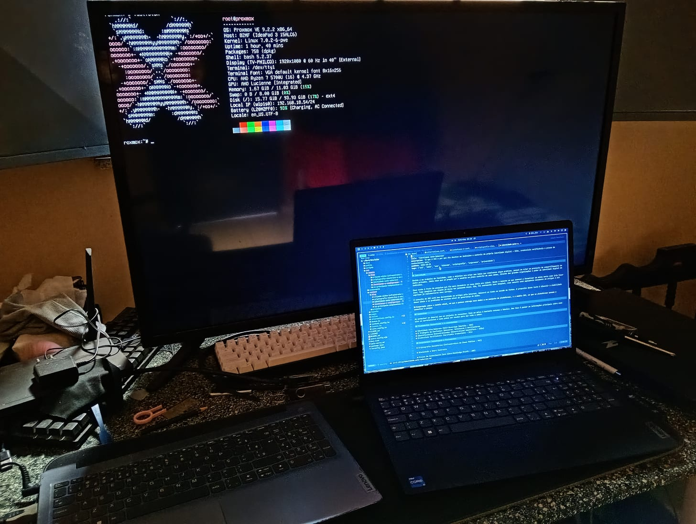

Nesse post vou dar início à instalação e configuração do Proxmox em um hardware
que não é o ideal, mas que deve servir pra um homelab modesto.

## Lenovo IdeaPad 3

Temos um Ryzen 7 5700U com 8 núcleos e 16 threads, somado a 12 GB de RAM --
4 GB soldados e 8 GB em um slot SO-DIMM para expansão.
Para disco, um slot NVMe, hoje com um SSD de 512 GB, mais uma baia para SSD SATA de 2,5"
que pretendo usar para backups.

O problema é a falta de porta ethernet nesse notebook. Isso fez a configuração
da rede ser a parte mais demorada no começo.


## O problema

Pelo que pesquisei, sem porta ethernet o Proxmox não consegue fazer bridge com a rede local, por limitação
do padrão 802.11, em que o ponto de acesso (AP) rejeita pacotes com MACs diferentes do autenticado.

Cada VM recebe uma interface virtual de rede que é conectada à bridge `vmbr0`, que em seguida
fala com a NIC física que está conectada via cabo ao roteador. Com isso, o roteador entrega os
IPs com DHCP e gerencia o NAT das VMs como se fossem máquinas físicas conectadas ao roteador.

A solução para contornar é o host fazer NAT, ou seja, virar o roteador. O certo nesse caso é comprar um adaptador
ethernet. Entretanto, eu usei a configuração com Wi-Fi por algumas semanas e funcionou muito bem. Se por algum
motivo você não puder usar um adaptador ethernet, essa solução se mostrou sólida -- graças ao Tailscale.

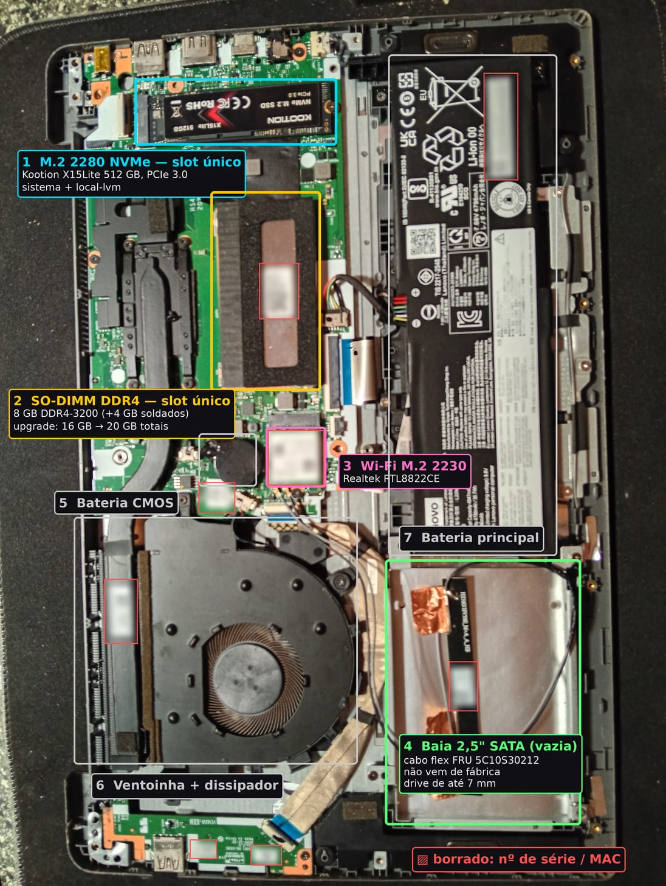

## Baixar a ISO e criar um pendrive bootável

Última versão na data em que escrevo esse post.

```bash
wget https://enterprise.proxmox.com/iso/proxmox-ve_9.2-1.iso
```

Verifique o hash (saída "OK" ou "FAILED"):

```bash
echo "<hash> proxmox-ve_9.2-1.iso" | sha256sum -c
```

Veja o hash da sua versão específica.

## Criar pendrive bootável

Eu costumo usar o Ventoy para pendrive bootável. Outras opções podem ser o Rufus ou BalenaEtcher.

Ou use o utilitário `dd`:

```bash
lsblk -o NAME,SIZE,MODEL,TRAN  # ache o pendrive
sudo umount /dev/sdX*          # o dispositivo precisa estar desmontado
sudo dd if=proxmox-ve_9.2-1.iso of=/dev/sdX bs=4M status=progress oflag=direct
sync                    # esvazia o que ainda estiver em cache
```

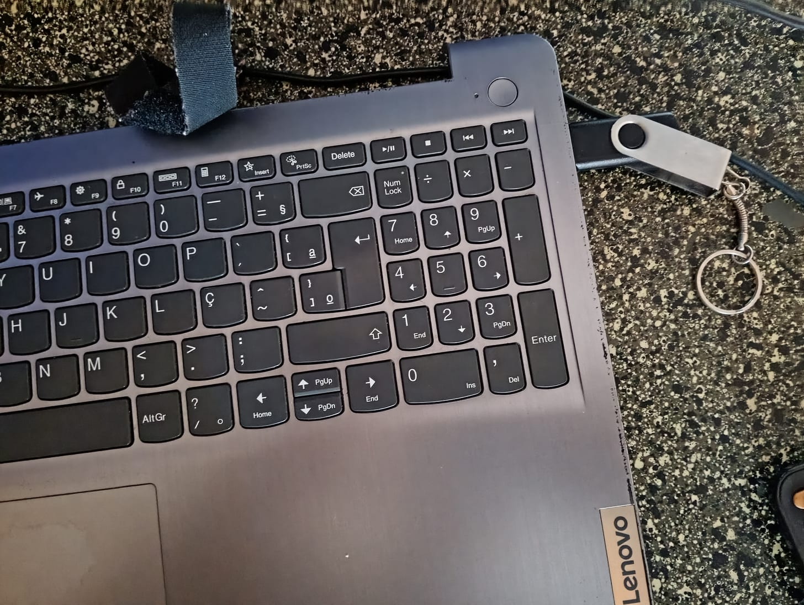

Se seu pendrive tiver LED, espere até ele parar de piscar para retirar, mesmo se o sistema notificar
a finalização da escrita da ISO.

## Bootando

Você pode usar as teclas F2 para a BIOS (UEFI) ou F12 para opções de boot.

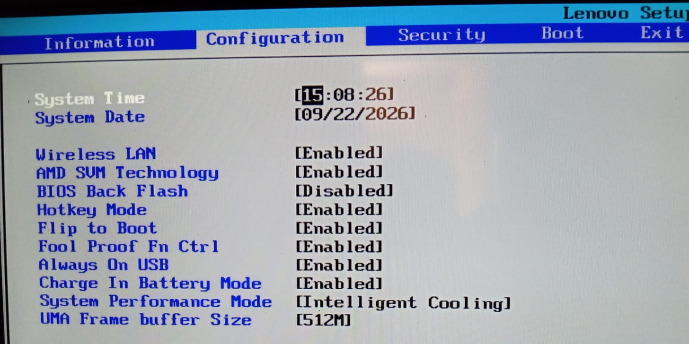

Entrar na BIOS e conferir, na aba Configuration:

- AMD SVM Technology → Enabled. Suporte à virtualização por hardware;
- UMA Frame buffer Size → menor valor possível. Reserva RAM para a Radeon integrada;
- System Performance Mode → Extreme Performance (opcional). Sobe o limite de potência sustentada da CPU.

Usando a seta para a direita você acessa o menu de boot e muda a ordem de boot.

Usando a tecla F12:

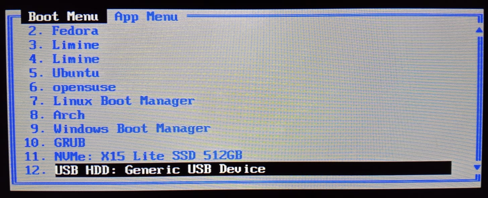

Pra você provavelmente aparecerá somente o sistema instalado (se tiver) e o pendrive. No meu caso
o pendrive é esse Generic USB Device.

## Instalador

Vamos prosseguir com a opção Install Proxmox VE (Graphical):

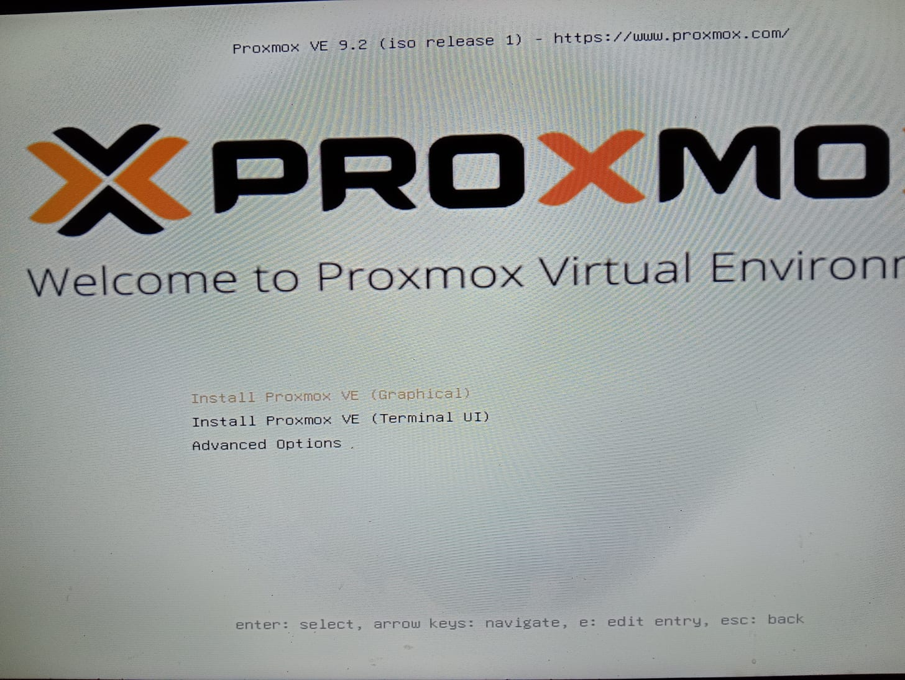
Não precisa se preocupar com a configuração de rede por enquanto. Tudo escolhido aqui vai mudar
na pós-instalação, menos o FQDN.

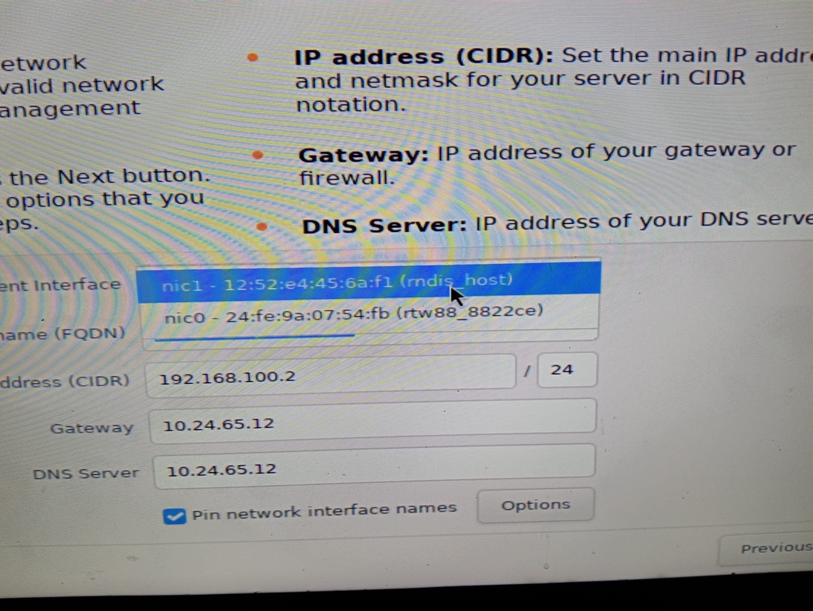

- `nic0`: placa Wi-Fi do notebook;
- `nic1`: interface do meu celular;

A `nic1` é necessária para fazer a instalação dos pacotes para configuração de rede na pós-instalação.
Entretanto, essa parte é irrelevante, pois a interface muda a cada replug, então o reboot de instalação
torna nossa escolha inútil.

A instalação é muito simples, a maioria das opções são pessoais, mas eis aí um exemplo da tela final.

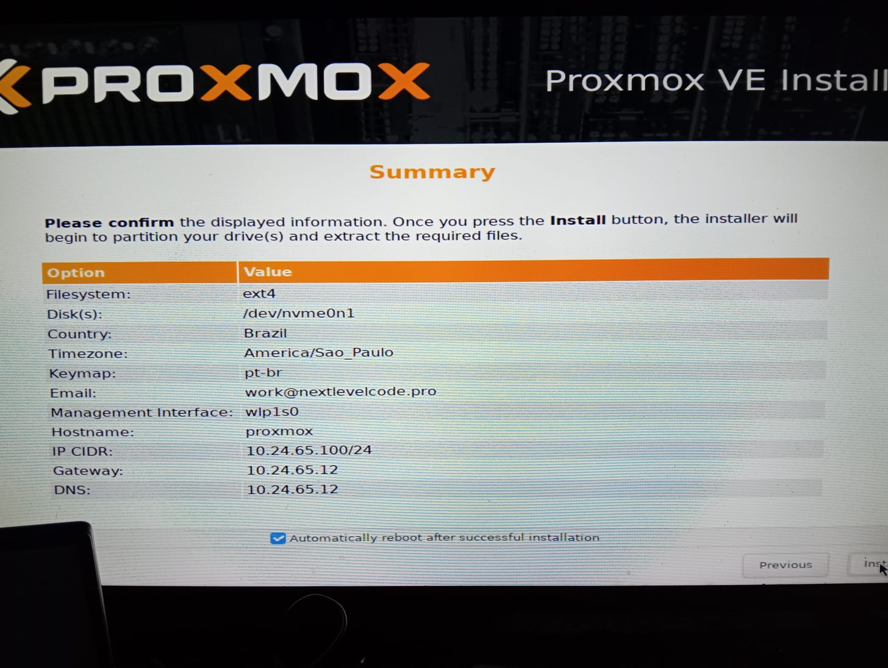


## Pós-instalação - sem adaptador ethernet

A forma mais fácil que tinha de criar uma interface de rede era o celular, opção tethering ligada no celular com
cabo USB:

```bash
ip -br link                    # descobrir o novo nome enx...
ip link set enxNOVONOME up
ip link set enxNOVONOME master vmbr0
dhclient vmbr0                 # pega IP e gateway do celular
```


`enx*` é a interface do celular e muda a cada replug do cabo.

`dhclient vmbr0` está aí por precaução, pois o IP configurado na instalação pode ter mudado no reboot.

Com isso, temos internet temporária para baixar os pacotes para fazer a configuração de rede.

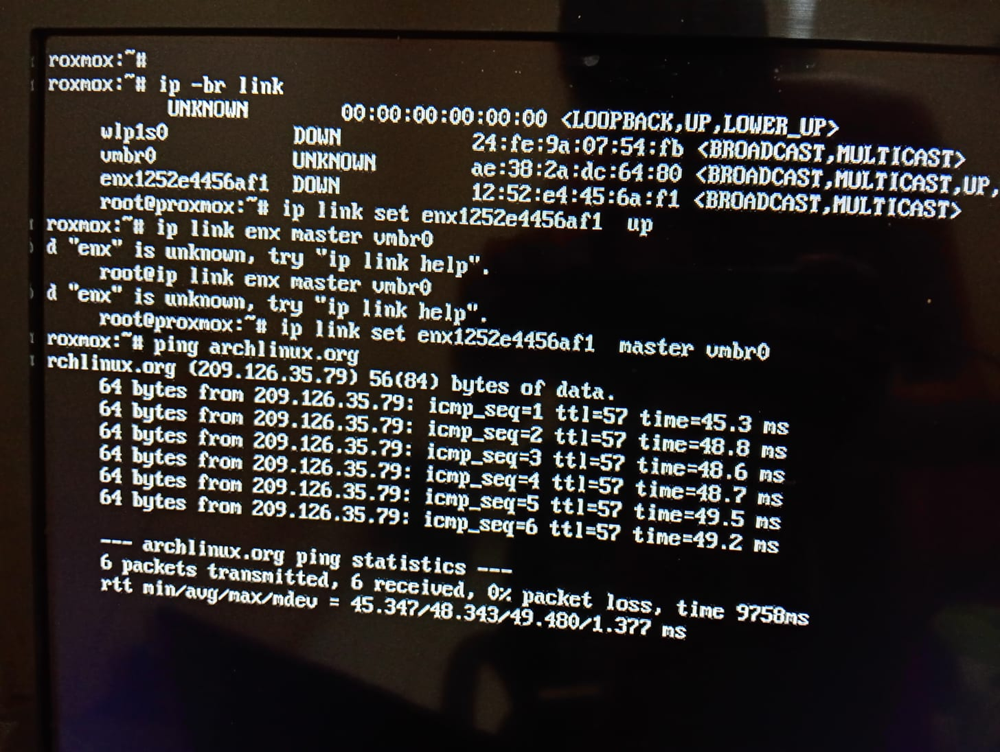

### Atualizando o sistema e baixando pacotes

Eu gosto de rodar o script [PVE Post Install](https://community-scripts.org/scripts/post-pve-install) logo de cara. Eis um exemplo de output do script:
```bash
 ✓ Disabled 'pve-enterprise' repository
 ✓ Disabled 'ceph enterprise' repository
 ✓ Added 'pve-no-subscription' repository
 ✗ Selected no to Adding 'ceph package repositories'
 ✓ Disabled all Ceph Enterprise repositories
 ✗ Selected no to Adding 'pvetest' repository
 ✓ Disabled subscription nag (Delete browser cache)
 ✓ Disabled high availability
 ✓ Disabled Corosync
 ✓ Updated Proxmox VE
 ✓ Completed Post Install Routines
```

Opte por não reiniciar até configurar o Wi-Fi.

Você também pode atualizar manualmente com:
```bash
apt update
apt full-upgrade
```

Instalando os pacotes:
```bash
apt install wpasupplicant rfkill iw vim
```

Escreva a senha da sua rede:
```
wpa_passphrase "NOME_DA_REDE" | tee /etc/wpa_supplicant/wpa_supplicant-wlp1s0.conf > /dev/null
```

```
vim /etc/wpa_supplicant/wpa_supplicant-wlp1s0.conf   # apagar a linha #psk=
chmod 600 /etc/wpa_supplicant/wpa_supplicant-wlp1s0.conf
```

Desbloquear e subir interfaces:
```
rfkill unblock all
ip link set wlp1s0 up
systemctl enable --now wpa_supplicant@wlp1s0
iw dev wlp1s0 link    # deve mostrar "Connected to ..."
```

Para finalizar, no arquivo `/etc/network/interfaces`:
```
auto lo
iface lo inet loopback

auto wlp1s0
iface wlp1s0 inet dhcp
    pre-up ip link set wlp1s0 up
    pre-up sleep 5

auto vmbr0
iface vmbr0 inet static
    address 10.10.10.1/24
    bridge-ports none
    bridge-stp off
    bridge-fd 0
    post-up echo 1 > /proc/sys/net/ipv4/ip_forward
    post-up iptables -t nat -A POSTROUTING -s 10.10.10.0/24 -o wlp1s0 -j MASQUERADE
    post-down iptables -t nat -D POSTROUTING -s 10.10.10.0/24 -o wlp1s0 -j MASQUERADE

source /etc/network/interfaces.d/*
```

Aplicar e verificar:
```
systemctl restart networking
ip -br a
ip route get 1.1.1.1        # deve responder "dev wlp1s0"
ping -c3 nextlevelcode.pro
```
Aqui você já pode retirar o cabo tethering e reiniciar para verificar a persistência entre
reboots.

## Acesso externo

Você pode usar `ip -br a` para ver o IP local, no meu caso: `https://192.168.18.54:8006`.

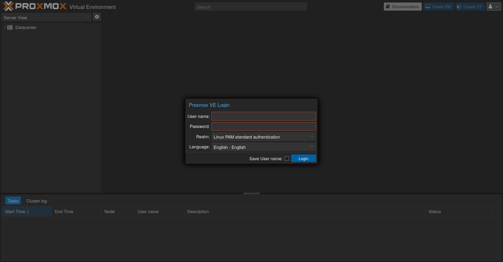

### VMs e Tailscale
Instalação do Tailscale:
```
curl -fsSL https://tailscale.com/install.sh | sh
tailscale up
tailscale ip -4
```

Ativar SSH:
```
tailscale set --ssh=true
```

O `tailscale serve` faz proxy do Proxmox Web UI. Isso permite acesso HTTPS com certificados
válidos gerados pelo Tailscale.
```
tailscale serve --bg https+insecure://localhost:8006
```
Temos acesso externo ao Proxmox agora, mas não às VMs.

### Subnet routers
[Doc do Tailscale](https://tailscale.com/docs/features/subnet-routers).

Vamos precisar do `dnsmasq`:
```
apt install dnsmasq
```

Configurar faixa de IPs das VMs:
```
tee /etc/dnsmasq.d/vmbr0.conf > /dev/null <<'EOF'
port=0 # desligar o servidor dns
interface=vmbr0
bind-interfaces
dhcp-range=10.10.10.100,10.10.10.200,12h
dhcp-option=option:router,10.10.10.1
dhcp-option=option:dns-server,1.1.1.1,8.8.8.8
EOF

systemctl restart dnsmasq
```

`port=0` desliga o servidor DNS do dnsmasq, que aqui só faz DHCP. A resolução das VMs fica
com os servidores passados em `dhcp-option=option:dns-server`.

Se quiser fixar o IP de uma VM acrescente no mesmo arquivo algo assim:
```
dhcp-host=BC:24:11:XX:XX:XX,10.10.10.50
```
O MAC está em VM → Hardware → Network Device.

Comando da doc do Tailscale:
```
echo 'net.ipv4.ip_forward = 1' | sudo tee -a /etc/sysctl.d/99-tailscale.conf
echo 'net.ipv6.conf.all.forwarding = 1' | sudo tee -a /etc/sysctl.d/99-tailscale.conf
sudo sysctl -p /etc/sysctl.d/99-tailscale.conf
```

Anuncie as rotas no tailscale:
```
tailscale set --advertise-routes=10.10.10.0/24
```

Prefira usar `set` em vez de `up`, o `set` altera só o que foi passado.

Aprove as rotas em `login.tailscale.com/admin/machines` e escolha o seu nó Proxmox.

Se você ainda não conseguir acessar tente `tailscale set --accept-routes` no cliente Linux.

Ou verifique suas ACLs no console -- isso já me custou horas debugando.

## Testando

Vou baixar uma ISO mínima do NixOS e ver se consigo alcançar a VM na minha rede local.

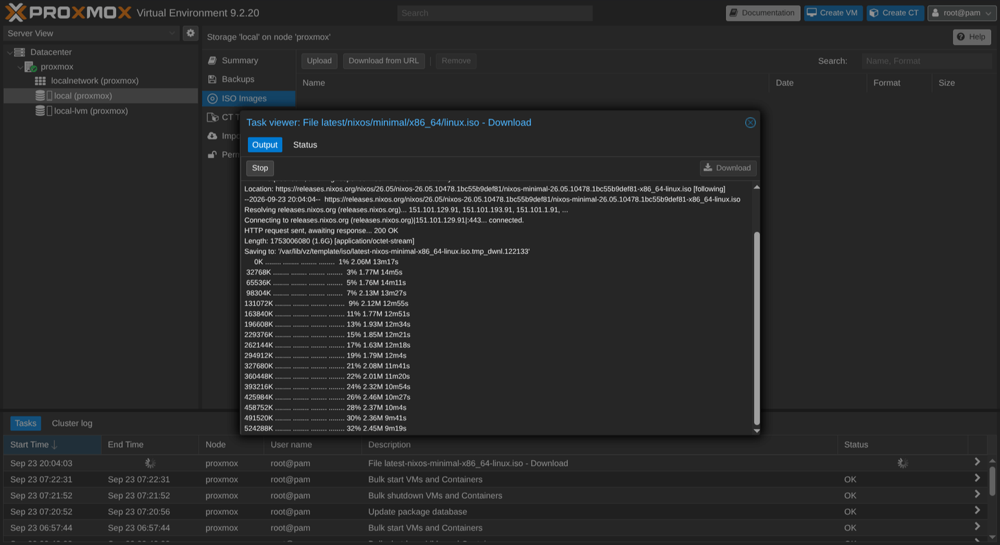

Dentro da VM:
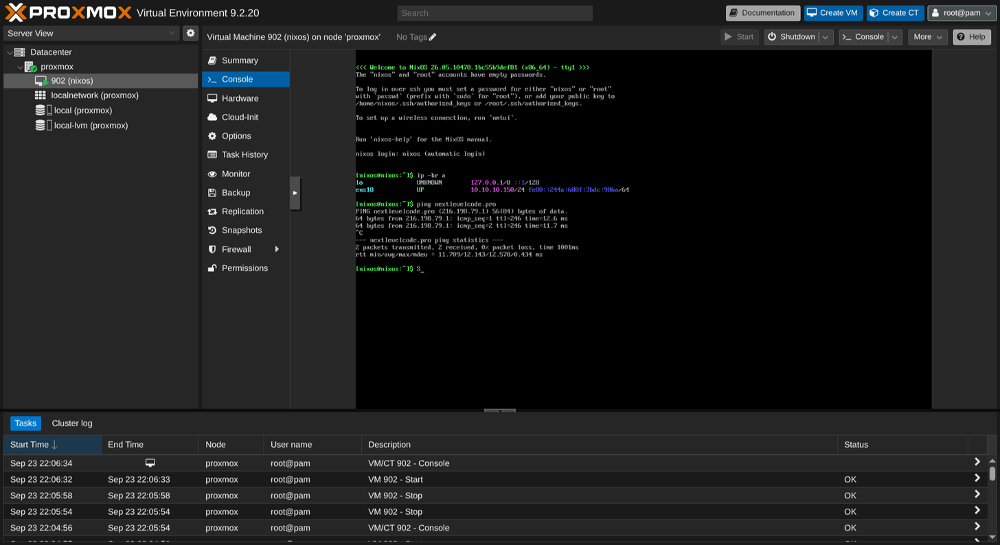
IP: `10.10.10.150`
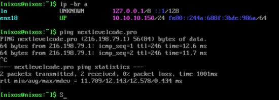

Meu notebook:
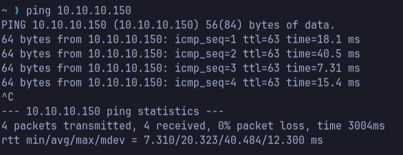

## Conclusão
Esse post mostrou uma forma de contornar a falta de uma entrada ethernet para poder expor o
Proxmox e acessar as VMs a partir de outros dispositivos com Tailscale.

Vou fazer um segundo post em complemento a esse da migração dessa configuração para o
adaptador ethernet -- que é bem mais simples. Com isso vamos tirar esse duplo NAT da VM
para a internet, e a rota do `10.10.10.0/24` vai embora junto. Para as VMs continuarem
alcançáveis de fora, ainda vai ser preciso anunciar a rede da casa pelo host (subnet
router) ou rodar o Tailscale dentro de cada VM.

Também acaba com `wpasupplicant`, `rfkill` e `sleep 5` no boot. O risco da rede não voltar em
um reboot vai ser quase nulo.
