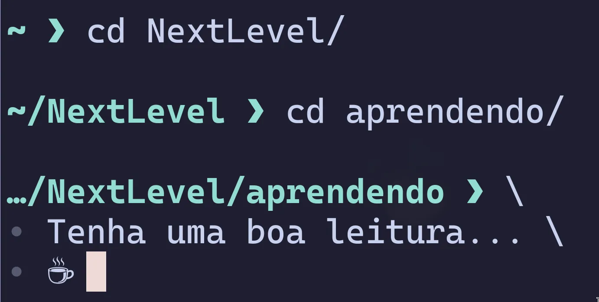

## Introdução

Nesse post vamos entender como funciona o controle de acesso no Linux. Entender esse conceito é entender como o sistema organiza e lida com todos os diretórios e arquivos em todo o sistema — diretórios também são arquivos que contem índices que apontam para outros arquivos e diretórios.

Existe um mantra famoso que diz:

> *Tudo é um arquivo*

Nesse contexto significa que tudo no **UNIX/Linux** é um arquivo — desde documentos de texto, programas e até dispositivos físicos como seu mouse, teclado, disco rígido e até mesmo conexões de rede. Em última análise, tudo em seu computador é um stream of bytes (fluxo de bytes) que pode ser representado como arquivos. Isso torna as coisas muito mais simples — permite a manipulação de arquivos de configuração, facilita a criação de scripts e monitoramento do sistema.

Essa abstração permite uma forma de comunicação única dentro do sistema. A API[^1] (Interface de Programação de Aplicações) é um conjunto de chamadas do sistema (system call) disponíveis no Linux para interagir com arquivos. Como tudo é um arquivo, tanto a comunicação com seu mouse quanto com sua webcam podem usar a mesma API — pois tudo se resume a escrita e leitura de arquivos.

Esse conceito foi criado pelos pais do UNIX[^2]. Assunto esse que geralmente é mal-entendido pelos iniciantes. O Linux adotou os mesmos conceitos-chave do UNIX, mas não é um derivado oficial como o macOS.

Diferente de sistemas derivados Unix, o Linux foi escrito do zero por Linus Torvalds e colaboradores. O Linux é um **Unix-like** (tipo Unix), ele foi projetado para funcionar e se comportar como um Unix.

Tanto o Linux quanto o GNU[^3] foram desenvolvidos para serem compatíveis com o POSIX[^4] (**P**ortable **O**perating **S**ystem **I**nterface). Mas sem nunca usar uma linha de código proprietário Unix.

Em outras palavras, o Linux é um derivado da Filosofia Unix.

Linux, Unix e GNU fazem parte de uma longa história que marcou o início de sistemas multitarefa e multiusuário. Porém, esse é outro assunto, deixo para os curiosos.

---

Antes de começar o assunto proposto para esse post, eu tinha que ao menos citar esses conceitos. Eles são a base tudo que vou discutir aqui, então resolvi passa essa introdução que pode vir a se torna posts futuros.

## Principais componentes de controle de acesso do Linux

Em segurança da informação, controle de acesso serve para gerenciar e restringir acesso a dados e recursos. Para garantir que somente partes autorizadas tenham acesso a informações confidencias. No Linux são usados 3 componentes principais para implementar esse controle: **usuários**, **grupos** e **permissões**.

## Entendendo usuários

Em geral, um usuário é quem interage ou manipulam arquivos no sistema; cada um é identificado por um User ID (`UID`) diferente.

### Usuários normais (Regular Users)

Usuário ligado a uma pessoa que interage com o sistema (você e eu); restrito somente a áreas autorizadas dentro do sistema.

IDs de usuários normais começam a partir de 1000 até um valor de limite definido — comum ser 60000 — pode depender da distribuição.

### Usuários do sistema (System Users)

Encarregados de executar processos em background, conhecidos como daemons (demônios). São responsáveis por gerência tarefas internas de programas sem interação direta de uma pessoa (usuário normal); garante o acesso mínimo a partes sensíveis do sistema. Assim fazendo com que os programas somente interajam com partes necessárias para seu funcionamento (Least Privilege[^5]).

IDs de usuários do sistema começam de 1 a 999.

### Super usuário (`root`)

Usuário com acesso total a todos os recursos do sistema; pode passar por todas as restrições do kernel. Não é recomendado operar como `root` para tarefas diárias, por questões de segurança e para evitar apagar acidentalmente arquivos importantes, já que o `root` pode passar por todas as restrições. Crie um usuário e então conceda privilégio de `root`; opere como `root` somente quando necessário — usando `sudo`.

O usuário `root` tem o ID 0 reservado.

## Entendendo grupos

Em um cenário onde uma dúzia de usuários devem ter acesso a um diretório — pode ser um diretório de projeto —, ao invés de dar permissão a cada um deles. Basta adicionar os usuários a um grupo com as permissões necessárias. Dessa forma, a organização, manipulação e gerenciamento de permissões se tornam mais escalável e menos suscetível a erros.

### Grupos primários e secundários

- **Grupo primário:** na criação de um usuário também é criado um grupo com seu nome — quando não especificado um grupo. Esse grupo tem um `GID` armazenado com o ID do usuário — dê uma olhada em `/etc/passwd`. Quando o usuário cria um arquivo, a propriedade desse arquivo é atribuída por padrão ao grupo primário do usuário.

- **Grupo secundário**: grupos em que o usuário foi adicionado; assim ganhando permissões a partes do sistema que não são de sua propriedade.

### Grupos do sistema e grupos customizados

- **Grupos do sistema (System Groups)**: distribuições Linux vem com um conjunto de grupos predefinidos no sistema. Esses grupos são usados internamente pelo sistema e também para dar privilégios a um usuário. Exemplos de grupos do sistema: `root`, `wheel`, `adm`, e `sys`. Cada grupo concede privilégios diferentes, como ler logs (`adm`) ou usar comandos com privilégios de `root` (`wheel` ou sudo).

- **Grupos customizados (Custom Groups)**: são grupos criados para fins específicos, como gerencia um projeto ou departamento. Por exemplo, você pode criar um grupo chamado *development* e adicionar usuários a ele. Dessa forma, você estabelece restrições claras de acesso ao diretório.

## Trio de permissões

Até agora falei sobre permissões, mas não exatamente sobre quais permissões. São elas: `read` (ler), `write` (escrever) e `execute` (executar). Porém, como cada uma dar ou retira um privilégio, depende de onde ela está sendo aplicada — em um diretório ou arquivo.

### Permissões em arquivos

- `read` (`r`): concede poder de abrir e ler o conteúdo de um arquivo. Necessário para certos comandos funcionarem, como: `cat`, `less` e `grep`.

- `write` (`w`): concede poder de modificar o conteúdo de um arquivo. Permissão necessária para editores de texto e a operadores como `>` e `>>`.

- `execute` (`x`): concede poder de executar/rodar um arquivo como um programa ou script. Isso é aplicado em executáveis e scripts de shell.

### Permissões em diretórios

- `read` (`r`): concede poder de listar subdiretórios e arquivos em um diretório. Essa permissão é o que permite o comando `ls` lista conteúdos.

- `write` (`w`): concede poder de modificar o conteúdo de um diretório, como: renomear, criar e apagar arquivos e diretórios. Essa permissão é a que permite comandos como: `mkdir`, `touch`, `mv` e outros funcionarem.

- `execute` (`x`): concede poder de entrar em um diretório — usando o comando `cd`. Sem a permissão de execução em um diretório, permissões de escrita e leitura se tornam inúteis; tendo em vista que você não pode entrar no diretório.

## Comportamento de permissões em diretórios e arquivos

O comportamento combinado das permissões faz com que o sistema seja ainda mais restrito a conceder acesso a dados do sistema. Por exemplo: um usuário pode ter acesso total (`rwx`) ao arquivo `/home/project/data.txt`. Mas sem a permissão `x` no diretório `/home/project` qualquer tentativa de acesso ao arquivo será negada com o erro *“Permission denied”* (Permissão negada). Isso é extremamente importante, pois protege uma árvore completa de subdiretórios e arquivos.

## Conclusão

Nesse post aprendemos sobre os 3 componentes principais no controle de acesso do Linux, com isso em mente podemos nos sentir mais confiantes para manipulá-los a nossa maneira. E é exatamente sobre isso que vamos discutir no próximo post sobre esse assunto. Vou mostrar exemplos práticos usando os principais comandos para manipular usuários, grupos e permissões. Além de boas práticas de segurança e dicas técnicas. Para não perder o `#2`, assine o [RSS](/rss.xml).

Espero que esse conteúdo tenha agregado conhecimento a você.

[^1]: É um conjunto de regra e protocolos implementadas em um software que permite outros softwares utilizá-lo de forma simplificada.

[^2]: É uma família de sistemas operacionais, conhecida por sua portabilidade, multiusuário e multitarefa.

[^3]: O GNU é a parte do sistema que fornece os programas e utilitários, como o compilador GCC e o interpretador de comandos `BASH`.

[^4]: É uma família de normas definidas pelo IEEE para a manutenção de compatibilidade entre sistemas operacionais, e designada formalmente por IEEE 1003.

[^5]: O princípio do menor privilégio, significa que usuários, processos e programas devem ter apenas os privilégios estritamente necessários para executar suas funções.
