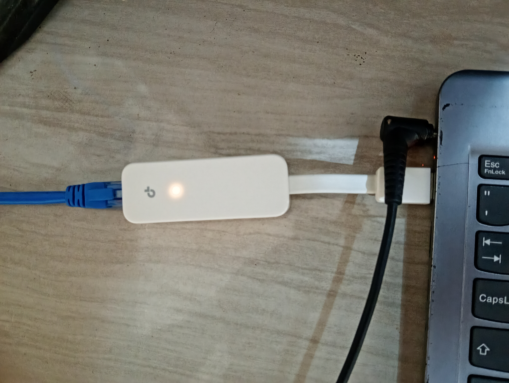
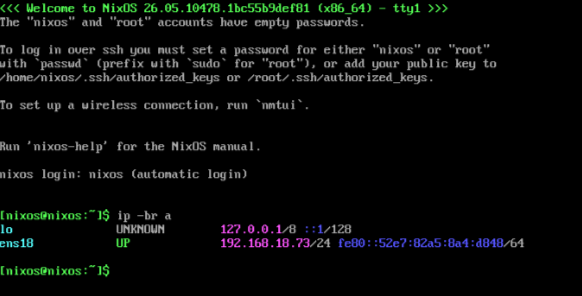

## Introdução
Vindo do post [Instalação e configuração inicial do Proxmox](https://www.nextlevelcode.pro/blog/instalacao-e-configuracao-inicial-do-proxmox/).

Nesse post vou mostrar como fazer a migração para o adaptador.

Comprei esse: [Adaptador Rede Ethernet Gigabit Usb 3.0 Lan Tp Link Ue300](https://www.mercadolivre.com.br/up/MLBU4009974614?pdp_filters=item_id:MLB4709030211&matt_tool=38524122#origin=share&sid=share&wid=MLB4709030211&action=copy)


## Duas opções
Você altera os `bridge-ports` da `vmbr0` para a nova interface ethernet ao invés
da `wlp1s0`. Que na prática só muda de onde a internet está vindo.

Ou desfazemos tudo do último post e incluímos a interface ethernet como membro da `vmbr0`
— que é a que vou mostrar aqui. Dessa vez a bridge poderá ser estabelecida corretamente e as
VMs vão receber IPs na rede local naturalmente.

## Implementando
Descubra a interface do adaptador:
```bash
ip -br a
```

Parar o `dnsmasq`:
```bash
systemctl disable --now dnsmasq
```

Remover rotas do Tailscale:
```bash
tailscale set --advertise-routes=""
```

Necessário pois a faixa de IP das VMs vai mudar.

Atualizar `/etc/network/interfaces`:
```
auto lo
iface lo inet loopback

auto vmbr0
iface vmbr0 inet dhcp
    bridge-ports enxSEU_MAC    # substitua pelo nome da interface, ex: enx00e04c680001
    bridge-stp off
    bridge-fd 0

source /etc/network/interfaces.d/*
```

Aplicar:

> **Atenção:** os comandos abaixo podem fazer você perder conexão SSH. Certifique-se de ter acesso
> físico à máquina antes de continuar.

```bash
systemctl restart networking
```

Verifique:
```bash
ip -br a                    # novo IP na vmbr0
ip route get 1.1.1.1        # deve mostrar dev vmbr0
ping -c5 1.1.1.1
```

Atualize `/etc/hosts` com o novo IP.

Verifique se está tudo ok.

## VMs
Agora as VMs vão pedir DHCP ao roteador. Exemplo com a mesma VM do post passado:


Fazendo `ping` para a VM dessa vez só será possível na rede local. Se ainda quiser Subnet routers,
é só rodar o mesmo comando anterior com a nova faixa de IPs. Exemplo:
```bash
tailscale set --advertise-routes=192.168.18.0/24
```

Mas atenção. Se você divide sua tailnet e tem ACLs permissivas, toda sua rede doméstica
vai estar exposta a dispositivos autenticados à sua tailnet.

Vale mencionar que o `tailscale serve --bg https+insecure://localhost:8006` ainda funciona.

## Fim
Espero que o conteúdo tenha agregado.
